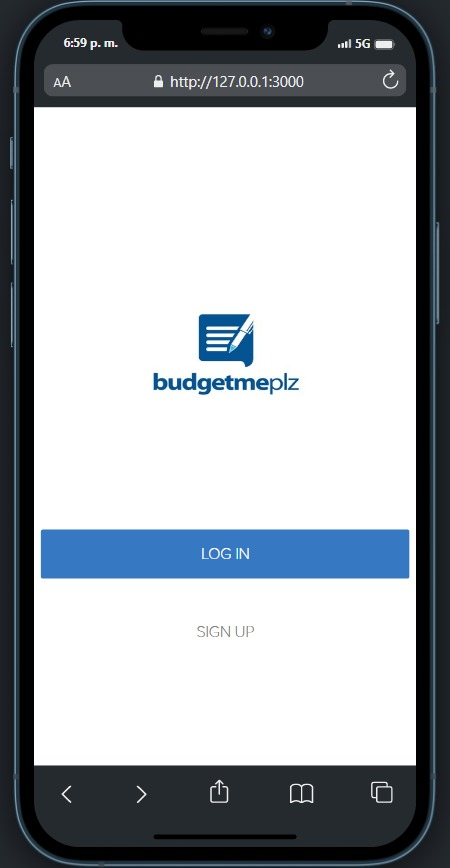
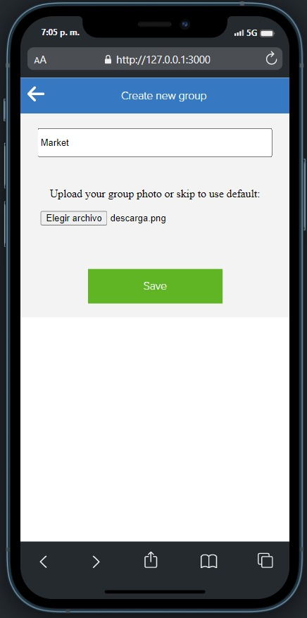
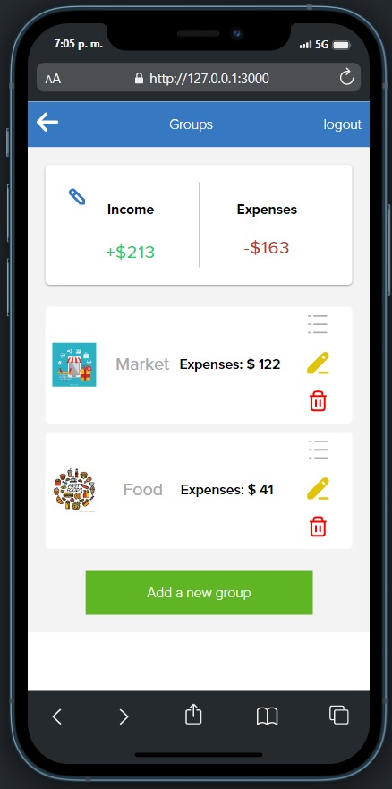
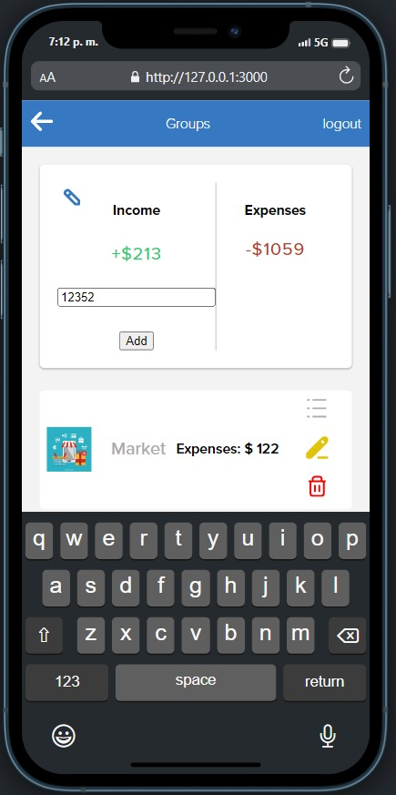

<!--
HOW TO USE:
This is an example of how you may give instructions on setting up your project locally.

Modify this file to match your project and remove sections that don't apply.

REQUIRED SECTIONS:
- Table of Contents
- About the Project
  - Built With
  - Live Demo
- Getting Started
- Authors
- Future Features
- Contributing
- Show your support
- Acknowledgements
- License

After you're finished please remove all the comments and instructions!
-->

  <!-- You are encouraged to replace this logo with your own! Otherwise you can also remove it. -->
  
   

  <h3><b>Wander Gonzalez -- Budget App</b></h3>

<!-- TABLE OF CONTENTS -->

# 📗 Table of Contents

- [📖 About the Project](#about-project)
  - [🛠 Built With](#built-with)
    - [Tech Stack](#tech-stack)
    - [Key Features](#key-features)
  - [🚀 Live Demo](#live-demo)
- [💻 Getting Started](#getting-started)
  - [Setup](#setup)
  - [Prerequisites](#prerequisites)
  - [Install](#install)
  - [Usage](#usage)
  - [Run tests](#run-tests)
  - [Deployment](#triangular_flag_on_post-deployment)
- [👥 Authors](#authors)
- [🔭 Future Features](#future-features)
- [🤝 Contributing](#contributing)
- [⭐️ Show your support](#support)
- [🙏 Acknowledgements](#acknowledgements)
- [❓ FAQ](#faq)
- [📝 License](#license)

<!-- PROJECT DESCRIPTION -->

# 📖 Budget App 

Introducing the Budget App - a mobile and web-based application that simplifies budget management. With this app, users can easily track their income and expenses, edit or delete each expense or category, and view a list of transactions categorized by type.

The Budget App provides an intuitive interface that makes it easy for users to manage their finances on the go. Users can view their total income and expenses in real-time, giving them an accurate picture of their financial health at a glance.

One of the standout features of the Budget App is the ability to categorize transactions. Users can assign each transaction to a specific category, such as groceries, entertainment, or rent. This allows users to see how much money they are spending on each category and make adjustments as needed.

Editing or deleting expenses and categories is also a breeze with the Budget App. Users can easily make changes to any transaction or category with just a few taps or clicks.

Whether you're on a tight budget or just looking to keep track of your spending, the Budget App is the perfect tool for managing your finances. With its user-friendly interface, intuitive features, and powerful tracking capabilities, it's the ultimate budget management solution for anyone who wants to stay on top of their money.

## 🛠 Built With 

### Tech Stack 

- Ruby on Rails
- RSpec
- Capybara
- PostgreSQL
- Devise

  
Client

  <ul>
    <li><a href="https://reactjs.org/">React.js</a></li>
  </ul>

  
Server

  <ul>
    <li><a href="https://expressjs.com/">Express.js</a></li>
  </ul>

Database

  <ul>
    <li><a href="https://www.postgresql.org/">PostgreSQL</a></li>
  </ul>

<!-- Features -->

<!-- ### Key Features 

> Describe between 1-3 key features of the application.

- **[key_feature_1]**
- **[key_feature_2]**
- **[key_feature_3]**

(<a href="#readme-top">back to top</a>)
 -->

<!-- LIVE DEMO -->

## 🚀 Live Demo 

- [Live Demo Link](https://budget-app-vmhn.onrender.com/home)

(<a href="#readme-top">back to top</a>)

<!-- GETTING STARTED -->

### Prerequisites
- Ruby
- PostgreSQL user with enough permissions for managing databases

### Setup
- Clone this repository in your local machine by using `git clone git@github.com:wandergithub/budget-app.git`
- Update `config/database.yml` file in order to set a working user/password postgresql account
### Install
- `cd budgie-app`
- Install the dependencies with `bundle install`

### Usage
- Run the app with `rails server`
- In your browser had to [http://localhost:3000](http://localhost:3000)

### Testing
- Run the tests with `rspec`
## Authors

(<a href="#readme-top">back to top</a>)

<!-- AUTHORS -->

## 👥 Authors 

👤 **Author1**

- GitHub: [@wandergithub](https://github.com/wandergithub)
- Twitter: [@wanderklk1](https://twitter.com/wanderklk1)
- LinkedIn: [Wander A. Gonzalez](https://www.linkedin.com/in/wander-a-gonzalez-53127b205/)

(<a href="#readme-top">back to top</a>)

<!-- FUTURE FEATURES -->

<!-- ## 🔭 Future Features 

> Describe 1 - 3 features you will add to the project.

- [ ] **[new_feature_1]**
- [ ] **[new_feature_2]**
- [ ] **[new_feature_3]**

(<a href="#readme-top">back to top</a>)
 -->

<!-- CONTRIBUTING -->

## 🤝 Contributing 

Contributions, issues, and feature requests are welcome!

Feel free to check the [issues page](../../issues/).

(<a href="#readme-top">back to top</a>)

<!-- SUPPORT -->

## ⭐️ Show your support 

Give a ⭐️ if you like this project!

(<a href="#readme-top">back to top</a>)

<!-- ACKNOWLEDGEMENTS -->

## 🙏 Acknowledgments 

- Hat tip to anyone whose code was used
- Inspiration
- Original design idea by [Gregoire Vella on Behance](https://www.behance.net/gregoirevella)

<!-- 
(<a href="#readme-top">back to top</a>)
 -->

<!-- FAQ (optional) -->

<!-- ## ❓ FAQ 

> Add at least 2 questions new developers would ask when they decide to use your project.

- **[Question_1]**

  - [Answer_1]

- **[Question_2]**

  - [Answer_2] -->

(<a href="#readme-top">back to top</a>)

<!-- LICENSE -->

## 📝 License 

This project is [MIT](./MIT.md) licensed.

(<a href="#readme-top">back to top</a>)

